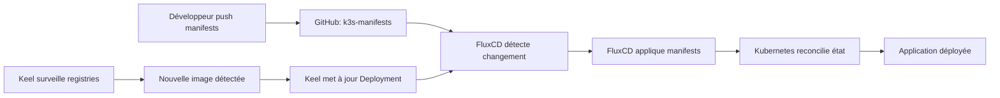

# Documentation du dépôt `k3s-manifests`


## Vue d'ensemble

Ce dépôt contient l'ensemble des **manifestes Kubernetes** déployés sur l'infrastructure **LoutikCLOUD**. Il constitue la source de vérité pour toutes les ressources Kubernetes gérées par FluxCD via GitOps.

## Architecture du dépôt

```text
loutik-cloud_k3s-manifests/
├── apps/
│   ├── <nom-du-service>/
│   │   ├── deployment.yaml
│   │   ├── service.yaml
│   │   └── ingress.yaml
└── infrastructure/
```

## Structure détaillée

### 📁 `apps/`

Répertoire centralisant toutes les **applications métiers** de la plateforme LoutikCLOUD.

**Principes d'organisation :**
- Un sous-dossier par application
- Isolation complète de chaque service
- Facilite la gestion des versions et des rollbacks

**Exemples d'applications :**
- `apps/outline/` : Wiki collaboratif
- `apps/homepage/` : Dashboard d'accueil
- `apps/vaultwarden/` : Gestionnaire de mots de passe
- `apps/nextcloud/` : Stockage et collaboration

---

### 📁 `apps/<nom-du-service>/`

Dossier dédié contenant **exclusivement les ressources Kubernetes** d'une application spécifique.

**Contenu standard :**
- Manifestes de déploiement (Deployment, StatefulSet)
- Configuration réseau (Service, Ingress)
- Ressources optionnelles (ConfigMap, Secret, PVC)

**Isolation :**
- ✅ Chaque application est autonome
- ✅ Pas de dépendances inter-dossiers
- ✅ Facilite le debug et la maintenance

---

### 📄 `apps/<nom-du-service>/deployment.yaml`

Fichier définissant la **création et la gestion des Pods** de l'application.

**Responsabilités :**
- Spécifie l'image Docker à déployer
- Configure les ressources (CPU, RAM)
- Définit les variables d'environnement
- Gère la stratégie de déploiement (RollingUpdate, Recreate)

**Point clé - Intégration Keel :**

C'est dans ce fichier que les **annotations Keel** doivent être ajoutées pour automatiser la mise à jour des images Docker :

```yaml
apiVersion: apps/v1
kind: Deployment
metadata:
  name: homepage
  namespace: default
  annotations:
    keel.sh/policy: all         # Politique de mise à jour automatique
    keel.sh/trigger: poll       # Mode de détection (poll ou webhook)
spec:
  replicas: 1
  selector:
    matchLabels:
      app: homepage
  template:
    metadata:
      labels:
        app: homepage
    spec:
      containers:
      - name: homepage
        image: ghcr.io/gethomepage/homepage:latest
        ports:
        - containerPort: 3000
```

**Annotations Keel disponibles :**
- `keel.sh/policy: all` : Met à jour toutes les versions (latest, tags)
- `keel.sh/policy: major` : Uniquement les versions majeures (v2.x.x)
- `keel.sh/policy: minor` : Uniquement les versions mineures (v1.2.x)
- `keel.sh/policy: patch` : Uniquement les patches (v1.0.1)
- `keel.sh/trigger: poll` : Polling régulier du registry
- `keel.sh/pollSchedule: "@every 5m"` : Fréquence de polling personnalisée

---

### 📄 `apps/<nom-du-service>/service.yaml`

Fichier exposant l'application sur le **réseau interne du cluster**.

**Fonction :**
- Crée un point d'entrée stable pour l'application
- Fournit un load-balancing automatique entre les Pods
- Permet la communication inter-services

**Exemple :**
```yaml
apiVersion: v1
kind: Service
metadata:
  name: homepage
  namespace: default
spec:
  selector:
    app: homepage
  ports:
  - protocol: TCP
    port: 80
    targetPort: 3000
  type: ClusterIP
```

**Types de Service courants :**
- `ClusterIP` : Accès interne uniquement (par défaut)
- `NodePort` : Expose le service sur un port de chaque nœud
- `LoadBalancer` : Provisionne un load balancer externe

---

### 📄 `apps/<nom-du-service>/ingress.yaml`

Fichier de **routage HTTP/HTTPS** permettant de rendre l'application accessible depuis l'extérieur du cluster.

**Fonction :**
- Expose l'application via un nom de domaine
- Gère le TLS/SSL (certificats)
- Configure le routage basé sur les paths ou hosts

**Exemple :**
```yaml
apiVersion: networking.k8s.io/v1
kind: Ingress
metadata:
  name: homepage
  namespace: default
  annotations:
    cert-manager.io/cluster-issuer: letsencrypt-prod
    traefik.ingress.kubernetes.io/router.entrypoints: websecure
spec:
  ingressClassName: traefik
  rules:
  - host: home.loutik.cloud
    http:
      paths:
      - path: /
        pathType: Prefix
        backend:
          service:
            name: homepage
            port:
              number: 80
  tls:
  - hosts:
    - home.loutik.cloud
    secretName: homepage-tls
```

**Annotations courantes :**
- `cert-manager.io/*` : Gestion automatique des certificats SSL
- `traefik.ingress.kubernetes.io/*` : Configuration spécifique à Traefik
- `nginx.ingress.kubernetes.io/*` : Configuration spécifique à NGINX Ingress

---

### 📁 `infrastructure/`

Dossier réservé aux **outils et composants transverses** nécessaires au bon fonctionnement du cluster.

**Contenu type :**
- Keel (automatisation des mises à jour d'images)
- Cert-manager (gestion des certificats SSL)
- Monitoring (Prometheus, Grafana)
- Ingress controllers (Traefik, NGINX)
- Opérateurs Kubernetes

**Caractéristiques :**
- Indépendant des applications métiers
- Services partagés par toutes les applications
- Configuration globale du cluster

**Exemple d'arborescence :**
```text
infrastructure/
├── keel/
│   ├── deployment.yaml
│   └── service.yaml
├── cert-manager/
│   └── cluster-issuer.yaml
└── monitoring/
    ├── prometheus/
    └── grafana/
```

---

## Workflow de déploiement



1. **Développeur** modifie un manifeste et push sur `k3s-manifests`
2. **FluxCD** détecte le changement (polling Git)
3. **FluxCD** applique les manifestes modifiés
4. **Kubernetes** reconcilie l'état souhaité
5. **Keel** surveille les registries Docker en arrière-plan
6. **Keel** met à jour automatiquement les images selon les annotations

---

## Ajouter une nouvelle application

### 1. Créer la structure de dossiers

```bash
mkdir -p apps/<nom-service>
cd apps/<nom-service>
```

### 2. Créer les manifestes de base

**`deployment.yaml`** :
```yaml
apiVersion: apps/v1
kind: Deployment
metadata:
  name: <nom-service>
  namespace: default
  annotations:
    keel.sh/policy: minor
    keel.sh/trigger: poll
spec:
  replicas: 1
  selector:
    matchLabels:
      app: <nom-service>
  template:
    metadata:
      labels:
        app: <nom-service>
    spec:
      containers:
      - name: <nom-service>
        image: <registry>/<image>:<tag>
        ports:
        - containerPort: <port>
```

**`service.yaml`** :
```yaml
apiVersion: v1
kind: Service
metadata:
  name: <nom-service>
  namespace: default
spec:
  selector:
    app: <nom-service>
  ports:
  - port: 80
    targetPort: <port>
  type: ClusterIP
```

**`ingress.yaml`** :
```yaml
apiVersion: networking.k8s.io/v1
kind: Ingress
metadata:
  name: <nom-service>
  namespace: default
  annotations:
    cert-manager.io/cluster-issuer: letsencrypt-prod
spec:
  ingressClassName: traefik
  rules:
  - host: <service>.loutik.cloud
    http:
      paths:
      - path: /
        pathType: Prefix
        backend:
          service:
            name: <nom-service>
            port:
              number: 80
  tls:
  - hosts:
    - <service>.loutik.cloud
    secretName: <nom-service>-tls
```

### 3. Créer la Kustomization FluxCD

Dans le dépôt `flux-system`, créer `apps/<nom-service>-kustomization.yaml` (voir documentation `flux-system`).

### 4. Commit et push

```bash
git add apps/<nom-service>
git commit -m "feat: add <nom-service> manifests"
git push
```

FluxCD déploiera automatiquement l'application dans les minutes qui suivent.

---

## Bonnes pratiques

### Organisation
- ✅ **Un dossier par application** dans `apps/`
- ✅ **Nommage cohérent** : lowercase, tirets
- ✅ **Séparer apps et infrastructure** clairement

### Manifestes
- ✅ **Toujours spécifier les namespaces** explicitement
- ✅ **Définir les resource limits** (CPU, RAM)
- ✅ **Utiliser des labels** pour faciliter le filtrage
- ✅ **Ajouter des annotations** pour la documentation

### Keel
- ✅ **Choisir la bonne policy** selon la criticité
- ✅ **Tester en staging** avant production
- ✅ **Éviter `policy: all`** pour les apps critiques
- ✅ **Privilégier les tags sémantiques** aux `latest`

### Sécurité
- ✅ **Ne jamais commiter de secrets** en clair
- ✅ **Utiliser SealedSecrets** ou External Secrets
- ✅ **Activer TLS** sur tous les Ingress
- ✅ **Limiter les permissions** (RBAC)

---

## Commandes utiles

### Validation locale
```bash
# Valider la syntaxe YAML
yamllint apps/

# Dry-run Kubernetes
kubectl apply --dry-run=client -f apps/<service>/

# Vérifier avec kustomize
kustomize build apps/<service>/
```

### Debug en production
```bash
# Voir les ressources déployées
kubectl get all -n default -l app=<service>

# Logs de l'application
kubectl logs -n default -l app=<service> --tail=100

# Décrire le déploiement
kubectl describe deployment <service> -n default

# Voir les événements
kubectl get events -n default --sort-by='.lastTimestamp'
```

### Keel
```bash
# Vérifier le statut de Keel
kubectl logs -n kube-system -l app=keel

# Forcer une vérification d'image
kubectl annotate deployment <service> force-update="$(date)"
```

---

## Exemple complet : Application Homepage

### Structure des fichiers
```text
apps/homepage/
├── deployment.yaml
├── service.yaml
└── ingress.yaml
```

### `deployment.yaml`
```yaml
apiVersion: apps/v1
kind: Deployment
metadata:
  name: homepage
  namespace: default
  annotations:
    keel.sh/policy: minor
    keel.sh/trigger: poll
    keel.sh/pollSchedule: "@every 10m"
spec:
  replicas: 1
  selector:
    matchLabels:
      app: homepage
  template:
    metadata:
      labels:
        app: homepage
    spec:
      containers:
      - name: homepage
        image: ghcr.io/gethomepage/homepage:v0.8.0
        ports:
        - containerPort: 3000
        resources:
          requests:
            memory: "128Mi"
            cpu: "100m"
          limits:
            memory: "256Mi"
            cpu: "200m"
```

### `service.yaml`
```yaml
apiVersion: v1
kind: Service
metadata:
  name: homepage
  namespace: default
spec:
  selector:
    app: homepage
  ports:
  - protocol: TCP
    port: 80
    targetPort: 3000
  type: ClusterIP
```

### `ingress.yaml`
```yaml
apiVersion: networking.k8s.io/v1
kind: Ingress
metadata:
  name: homepage
  namespace: default
  annotations:
    cert-manager.io/cluster-issuer: letsencrypt-prod
    traefik.ingress.kubernetes.io/router.entrypoints: websecure
spec:
  ingressClassName: traefik
  rules:
  - host: home.loutik.cloud
    http:
      paths:
      - path: /
        pathType: Prefix
        backend:
          service:
            name: homepage
            port:
              number: 80
  tls:
  - hosts:
    - home.loutik.cloud
    secretName: homepage-tls
```

---

## Dépannage

### L'application ne démarre pas
```bash
# Vérifier les Pods
kubectl get pods -n default -l app=<service>

# Voir les logs
kubectl logs -n default <pod-name>

# Vérifier les événements
kubectl describe pod -n default <pod-name>
```

### Problème d'accès Ingress
```bash
# Vérifier l'Ingress
kubectl get ingress -n default

# Vérifier le certificat TLS
kubectl get certificate -n default

# Logs du contrôleur Ingress
kubectl logs -n kube-system -l app.kubernetes.io/name=traefik
```

### Keel ne met pas à jour
```bash
# Vérifier les annotations
kubectl get deployment <service> -o yaml | grep keel

# Logs Keel
kubectl logs -n kube-system -l app=keel --tail=50

# Forcer un poll
kubectl annotate deployment <service> keel.sh/force-update="true" --overwrite
```

---

## Liens utiles

- [Documentation Kubernetes](https://kubernetes.io/docs/)
- [Keel Documentation](https://keel.sh/)
- [Cert-Manager](https://cert-manager.io/)
- Dépôt FluxCD : [loutik-cloud_k3s-flux-system](https://github.com/FireToak/loutik-cloud_k3s-flux-system)

---

**Maintenu par l'équipe DevOps LoutikCLOUD 🦥**

*Dernière mise à jour : 16 février 2026*