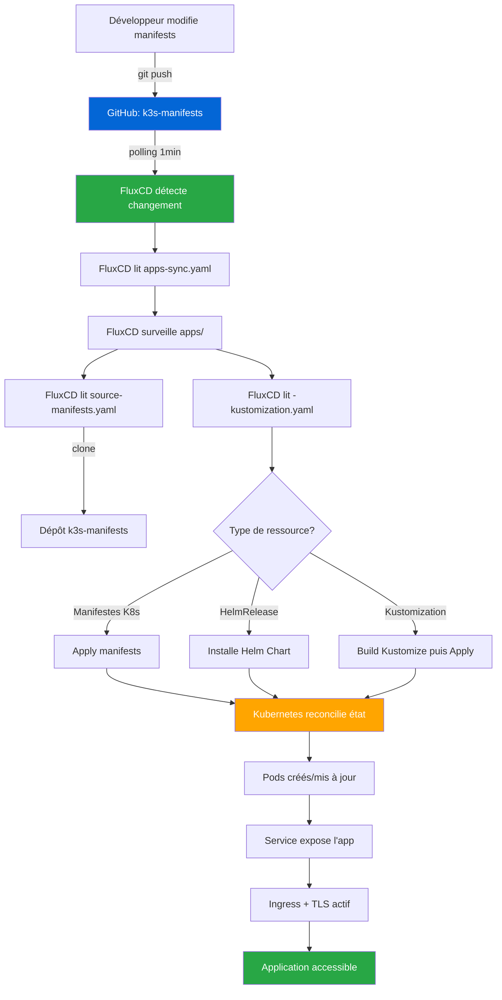

# Documentation du dépôt `k3s-manifests`


## Vue d'ensemble

Ce dépôt contient l'ensemble des **manifestes Kubernetes** déployés sur l'infrastructure **LoutikCLOUD**. Il constitue la source de vérité pour toutes les ressources Kubernetes gérées par FluxCD via GitOps.

---

## Arborescence du dépôt

```text
loutik-cloud_k3s-manifests/
├── readme.md
├── apps/
│   ├── authentik/
│   │   ├── authentik-helmrelease.yaml
│   │   ├── kustomization.yaml
│   │   └── namespace.yaml
│   ├── discord-bot-plc/
│   │   ├── deployment.yaml
│   │   └── namespace.yaml
│   ├── homepage-administrateur/
│   │   ├── bookmarks.yaml
│   │   ├── custom.css
│   │   ├── custom.js
│   │   ├── deployment.yaml
│   │   ├── docker.yaml
│   │   ├── ingress.yaml
│   │   ├── kubernetes.yaml
│   │   ├── kustomization.yaml
│   │   ├── middleware.yaml
│   │   ├── namespace.yaml
│   │   ├── services.yaml
│   │   ├── settings.yaml
│   │   └── widgets.yaml
│   ├── homepage-utilisateur/
│   │   └── [fichiers similaires à homepage-administrateur]
│   ├── portfolio-louis/
│   ├── site-docs/
│   │   ├── deployment.yaml
│   │   ├── ingress.yaml
│   │   └── namespace.yaml
│   ├── site-portfolio/
│   │   ├── deployment.yaml
│   │   ├── ingress.yaml
│   │   └── namespace.yaml
│   └── site-vitrine-loutik/
│       ├── deployment.yaml
│       ├── ingress.yaml
│       └── namespace.yaml
└── infrastructure/
    ├── monitoring/
    │   └── information.md
    └── traefik/
        ├── kustomization.yaml
        └── traefik-config.yaml
```

### Description des dossiers

**`apps/`**  
Répertoire centralisant toutes les **applications métiers** de la plateforme LoutikCLOUD. Chaque application dispose de son propre sous-dossier contenant ses ressources Kubernetes (Deployment, Service, Ingress, Namespace, ConfigMap, etc.). Cette organisation garantit l'isolation et facilite la maintenance individuelle de chaque service. Certaines applications utilisent des fichiers de configuration spécifiques (fichiers YAML de configuration Homepage, fichiers CSS/JS custom) ou des HelmRelease pour les déploiements Helm.

**`infrastructure/`**  
Dossier réservé aux **composants transverses et outils de cluster** indispensables au bon fonctionnement de l'infrastructure. Il héberge les configurations de services partagés comme Traefik (ingress controller), le monitoring (Prometheus, Grafana), et d'autres outils système. Ces composants sont indépendants des applications métiers et fournissent des fonctionnalités globales au cluster.

---

## Ajouter une nouvelle application

> **Prérequis** : Disposer d'une image Docker dans un registry accessible (Docker Hub, GHCR, GitLab Registry) ou d'une chart Helm pour l'application.

### 1️⃣ Créer la structure de l'application

```bash
# Se positionner à la racine du dépôt
cd loutik-cloud_k3s-manifests

# Créer le dossier de l'application
mkdir -p apps/<nom-du-service>
cd apps/<nom-du-service>
```

### 2️⃣ Créer le fichier `namespace.yaml`

Isoler chaque application dans son propre namespace est une bonne pratique.

```yaml
apiVersion: v1
kind: Namespace
metadata:
  name: <nom-du-service>
  labels:
    app: <nom-du-service>
```

### 3️⃣ Créer le fichier `deployment.yaml`

Ce fichier définit les Pods de l'application.

```yaml
apiVersion: apps/v1
kind: Deployment
metadata:
  name: <nom-du-service>
  namespace: <nom-du-service>
  labels:
    app: <nom-du-service>
spec:
  replicas: 1
  selector:
    matchLabels:
      app: <nom-du-service>
  strategy:
    type: RollingUpdate
    rollingUpdate:
      maxUnavailable: 0
      maxSurge: 1
  template:
    metadata:
      labels:
        app: <nom-du-service>
    spec:
      containers:
      - name: <nom-du-service>
        image: <registry>/<image>:<tag>
        ports:
        - containerPort: <port-application>
          name: http
        resources:
          requests:
            memory: "128Mi"
            cpu: "100m"
          limits:
            memory: "512Mi"
            cpu: "500m"
        env:
        - name: EXAMPLE_VAR
          value: "example-value"
        livenessProbe:
          httpGet:
            path: /
            port: http
          initialDelaySeconds: 30
          periodSeconds: 10
        readinessProbe:
          httpGet:
            path: /
            port: http
          initialDelaySeconds: 5
          periodSeconds: 5
```

### 4️⃣ Créer le fichier `service.yaml` (optionnel si pas d'Ingress)

Ce fichier expose l'application sur le réseau interne du cluster.

```yaml
apiVersion: v1
kind: Service
metadata:
  name: <nom-du-service>
  namespace: <nom-du-service>
  labels:
    app: <nom-du-service>
spec:
  selector:
    app: <nom-du-service>
  ports:
  - protocol: TCP
    port: 80
    targetPort: <port-application>
    name: http
  type: ClusterIP
```

### 5️⃣ Créer le fichier `ingress.yaml`

Ce fichier rend l'application accessible depuis l'extérieur via un nom de domaine.

```yaml
apiVersion: networking.k8s.io/v1
kind: Ingress
metadata:
  name: <nom-du-service>
  namespace: <nom-du-service>
  labels:
    app: <nom-du-service>
  annotations:
    cert-manager.io/cluster-issuer: letsencrypt-prod
    traefik.ingress.kubernetes.io/router.entrypoints: websecure
spec:
  ingressClassName: traefik
  rules:
  - host: <service>.loutik.cloud
    http:
      paths:
      - path: /
        pathType: Prefix
        backend:
          service:
            name: <nom-du-service>
            port:
              number: 80
  tls:
  - hosts:
    - <service>.loutik.cloud
    secretName: <nom-du-service>-tls
```

### 6️⃣ (Optionnel) Créer un fichier `kustomization.yaml`

Si l'application nécessite Kustomize pour gérer des ConfigMaps ou des ressources multiples :

```yaml
apiVersion: kustomize.config.k8s.io/v1beta1
kind: Kustomization
namespace: <nom-du-service>

resources:
- namespace.yaml
- deployment.yaml
- service.yaml
- ingress.yaml

configMapGenerator:
- name: <nom-du-service>-config
  files:
  - config.yaml
```

### 7️⃣ (Alternative) Utiliser Helm avec HelmRelease

Pour les applications déployées via Helm Chart :

```yaml
apiVersion: helm.toolkit.fluxcd.io/v2beta1
kind: HelmRelease
metadata:
  name: <nom-du-service>
  namespace: <nom-du-service>
spec:
  interval: 10m
  chart:
    spec:
      chart: <chart-name>
      version: <chart-version>
      sourceRef:
        kind: HelmRepository
        name: <repository-name>
        namespace: flux-system
  values:
    # Configuration spécifique de la chart
    replicaCount: 1
    image:
      repository: <registry>/<image>
      tag: <tag>
```

### 8️⃣ Valider localement les manifestes

```bash
# Vérifier la syntaxe YAML
yamllint apps/<nom-du-service>/

# Valider avec Kubernetes (dry-run)
kubectl apply --dry-run=client -f apps/<nom-du-service>/

# Si utilisation de Kustomize
kubectl kustomize apps/<nom-du-service>/ | kubectl apply --dry-run=client -f -
```

### 9️⃣ Créer la Kustomization FluxCD

Dans le dépôt `loutik-cloud_k3s-flux-system`, créer le fichier `apps/<nom-du-service>-kustomization.yaml` :

```yaml
apiVersion: kustomize.toolkit.fluxcd.io/v1
kind: Kustomization
metadata:
  name: <nom-du-service>
  namespace: flux-system
spec:
  interval: 10m
  sourceRef:
    kind: GitRepository
    name: manifests
  path: ./apps/<nom-du-service>
  prune: true
  wait: true
  timeout: 5m
```

### 🔟 Commit et déploiement

```bash
# Depuis le dépôt k3s-manifests
git add apps/<nom-du-service>
git commit -m "feat: add <nom-du-service> manifests"
git push

# Depuis le dépôt flux-system
git add apps/<nom-du-service>-kustomization.yaml
git commit -m "feat: add <nom-du-service> kustomization"
git push
```

FluxCD détectera automatiquement les changements et déploiera l'application dans les **minutes suivantes**.

### 1️⃣1️⃣ Vérifier le déploiement

```bash
# Surveiller la réconciliation FluxCD
flux get kustomizations -w

# Vérifier les ressources créées
kubectl get all -n <nom-du-service>

# Vérifier les pods
kubectl get pods -n <nom-du-service>

# Consulter les logs
kubectl logs -n <nom-du-service> -l app=<nom-du-service> --tail=50 -f

# Tester l'accès externe
curl https://<service>.loutik.cloud
```

---

## Rappel des bonnes pratiques

### 📂 Organisation des fichiers
- ✅ **Un namespace dédié par application** (`namespace.yaml`)
- ✅ **Nommage cohérent** : lowercase avec tirets (ex: `site-vitrine-loutik`)
- ✅ **Séparer clairement** `apps/` et `infrastructure/`
- ✅ **Utiliser Kustomize** quand l'application nécessite des ConfigMaps ou plusieurs ressources

### 📝 Manifestes Kubernetes
- ✅ **Toujours spécifier le namespace** explicitement dans chaque ressource
- ✅ **Définir les resource requests et limits** (CPU, RAM) dans les Deployments
- ✅ **Utiliser des labels cohérents** (`app: <nom-du-service>`)
- ✅ **Configurer les health checks** (livenessProbe, readinessProbe)
- ✅ **Stratégie RollingUpdate** avec `maxUnavailable: 0` pour zero-downtime

### 🔐 Sécurité
- ✅ **Ne jamais commiter de secrets en clair** (utiliser SealedSecrets ou External Secrets Operator)
- ✅ **Activer TLS sur tous les Ingress** (annotation cert-manager)
- ✅ **Utiliser des images avec tags spécifiques** plutôt que `latest`
- ✅ **Appliquer le principe du moindre privilège** (RBAC, SecurityContext)

### 🎯 Configuration avancée
- ✅ **Middleware Traefik** pour authentification centralisée (voir `homepage-administrateur`)
- ✅ **HelmRelease** pour applications complexes nécessitant Helm
- ✅ **ConfigMaps montés** pour fichiers de configuration (CSS, JS, YAML)

### 🔄 Gestion des versions
- ✅ **Commits sémantiques** : `feat:`, `fix:`, `chore:`, `docs:`
- ✅ **Messages descriptifs** incluant le nom du service
- ✅ **Tester localement** avant de push (dry-run)

---

## Debug

### Vérifier l'état de FluxCD

```bash
# Vue d'ensemble de toutes les ressources FluxCD
flux get all

# Vérifier les Kustomizations
flux get kustomizations

# Vérifier les sources Git
flux get sources git

# Logs des controllers FluxCD
flux logs --level=error --all-namespaces
```

### Forcer la réconciliation

```bash
# Forcer la réconciliation d'une source Git
flux reconcile source git manifests

# Forcer la réconciliation d'une Kustomization
flux reconcile kustomization <nom-du-service> --with-source

# Forcer la réconciliation de l'App of Apps
flux reconcile kustomization apps-sync --with-source
```

### Debug d'une application spécifique

```bash
# Vérifier le statut de la Kustomization
kubectl describe kustomization <nom-du-service> -n flux-system

# Voir les événements du namespace
kubectl get events -n <nom-du-service> --sort-by='.lastTimestamp'

# Vérifier les pods
kubectl get pods -n <nom-du-service>

# Logs d'un pod
kubectl logs -n <nom-du-service> <pod-name> --tail=100 -f

# Décrire un pod en erreur
kubectl describe pod -n <nom-du-service> <pod-name>
```

### Debug Ingress et réseau

```bash
# Vérifier les Ingress
kubectl get ingress -n <nom-du-service>

# Décrire un Ingress
kubectl describe ingress <nom-du-service> -n <nom-du-service>

# Vérifier les certificats TLS
kubectl get certificate -n <nom-du-service>

# Logs de Traefik
kubectl logs -n kube-system -l app.kubernetes.io/name=traefik --tail=100
```

### Suspendre/Reprendre un déploiement

```bash
# Suspendre une Kustomization (empêche FluxCD de réconcilier)
flux suspend kustomization <nom-du-service>

# Reprendre une Kustomization
flux resume kustomization <nom-du-service>
```

### Vérifier l'utilisation des ressources

```bash
# CPU et RAM par pod
kubectl top pods -n <nom-du-service>

# CPU et RAM par node
kubectl top nodes
```

---

## Workflow



### Étapes détaillées du workflow

1. **Modification des manifestes** : Le développeur modifie/ajoute des fichiers dans `loutik-cloud_k3s-manifests`
2. **Push vers GitHub** : Les changements sont committés et pushés sur le dépôt Git
3. **Détection par FluxCD** : FluxCD poll le dépôt Git toutes les minutes (configurable)
4. **Lecture de apps-sync.yaml** : FluxCD lit le fichier principal qui pointe vers `apps/`
5. **Surveillance du dossier apps/** : FluxCD surveille tous les fichiers Kustomization dans `apps/`
6. **Clone du dépôt** : FluxCD clone/met à jour sa copie locale du dépôt
7. **Traitement des Kustomizations** : Pour chaque `*-kustomization.yaml` trouvé :
   - Manifestes Kubernetes standards → Apply direct
   - HelmRelease → Installation via Helm
   - Kustomization → Build puis Apply
8. **Réconciliation Kubernetes** : Kubernetes compare l'état souhaité vs actuel
9. **Déploiement** : Les Pods sont créés/mis à jour selon la stratégie définie
10. **Exposition** : Le Service rend l'app accessible en interne
11. **Ingress + TLS** : Traefik route le trafic externe + Cert-Manager génère les certificats
12. **Application opérationnelle** : L'application est accessible via son URL publique

---

## Liens utiles

- [Documentation Kubernetes](https://kubernetes.io/docs/)
- [Documentation FluxCD](https://fluxcd.io/docs/)
- [Cert-Manager](https://cert-manager.io/)
- [Traefik Documentation](https://doc.traefik.io/traefik/)
- Dépôt FluxCD : [loutik-cloud_k3s-flux-system](https://github.com/FireToak/loutik-cloud_k3s-flux-system)

---

**Maintenu par l'équipe DevOps LoutikCLOUD 🦥**

*Dernière mise à jour : 18 février 2026*